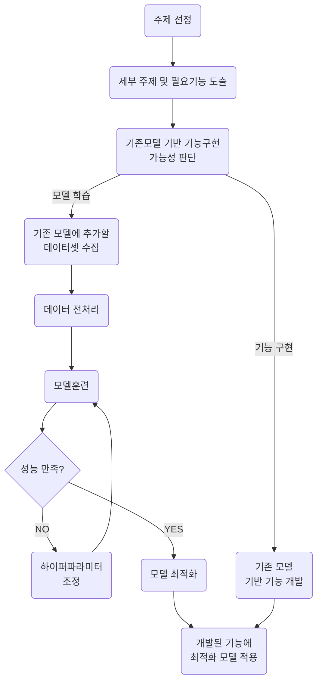

# 우리인재개발원(우리컴퓨터아카데미)
```
관심영역 기반 위험 예측 관제 시스템 개발
```
## 프로젝트 진행 프로세스
```
1. 타임 테이블 작성 (세부 일정 확정)
2. GitHub 생성 및 브랜치 전략 수립
3. 모델 개량, ROI기반 탐지, 관제시스템/각 팀별 작업
4. README.md 작성 (프로젝트 개요, 목표, 팀원 역할 포함)
5. 주제 선정 (인파 밀집의 세부 주제 확정)
6. 팀장 선정 및 역할 분배
7. 데이터 수집 및 전처리 담당
8. 모델 설계 및 학습 담당
9. 시스템 통합 및 구현 담당
10. 발표 자료 제작 및 문서화 담당
11. 1차 발표 (9월 10일)
12. 중간 진행 상황 보고
13. 최종 발표 (9월 11일)
14. 최종 모델 및 결과 발표

<추가 사항>
기술 스택 및 개발 환경 설정
사용할 프로그래밍 언어, 프레임워크, 라이브러리 결정
개발 환경(로컬/클라우드, Docker 사용 여부 등) 정리
이슈 트래킹 및 일정 관리
Jira, Trello, GitHub Projects 등을 활용한 일정 및 작업 관리
테스트 및 검증 프로세스 추가
테스트 기준 및 성능 평가 방법 정의
실시간 모니터링 및 배포 전략
시스템 운영 및 실시간 장애 감지 방안
리스크 관리 및 백업 계획
데이터 손실 방지를 위한 백업 방법
주요 리스크(데이터 부족, 모델 학습 문제 등) 사전 대응 방안
사용자 피드백 및 개선 사항 반영
1차 발표 후 피드백 수집 및 정리
추가 개선 작업 진행 여부 결정
```
## 1. 프로젝트 기간: 2025.09.03 ~ 2025.09.12
## 2. 프로젝트 명: 관심영역 기반 위험 예측 관제 시스템 개발
## 3. 프로젝트 주제: 인파밀집 경고 시스템
## 4. 사용 기술: Python, YOLOv11, RT-DETR, flask


