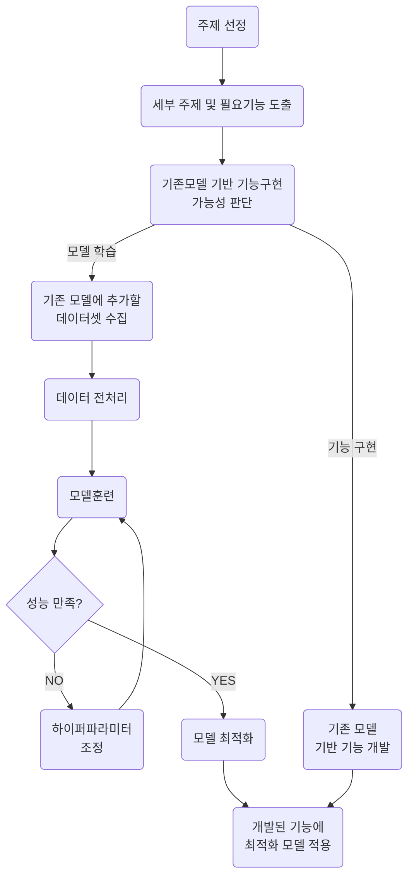

# 관심영역 기반 위험 예측 관제 시스템 개발

## 1. 프로젝트 기간: 2025.09.03 ~ 2025.09.12
## 2. 프로젝트 명: 관심영역 기반 위험 예측 관제 시스템 개발
## 3. 프로젝트 주제: 인파밀집 경고 시스템
## 4. 사용 기술: Python, YOLOv11, flask

```mermaid
flowchart TD

A("주제 선정") --> B("세부 주제 및 필요기능 도출") --> C("기존모델 기반 기능구현<br>가능성 판단")
C --모델 학습-->  E("기존 모델에 추가할<br>데이터셋 수집") --> F("데이터 전처리")--> G("모델훈련") --> H{"성능 만족?"}
H --NO--> L("하이퍼파라미터<br>조정") --> G
H --YES--> I("모델 최적화") --> J
C --기능 구현--> D("기존 모델<br>기반 기능 개발") --> J("개발된 기능에<br>최적화 모델 적용")
```
